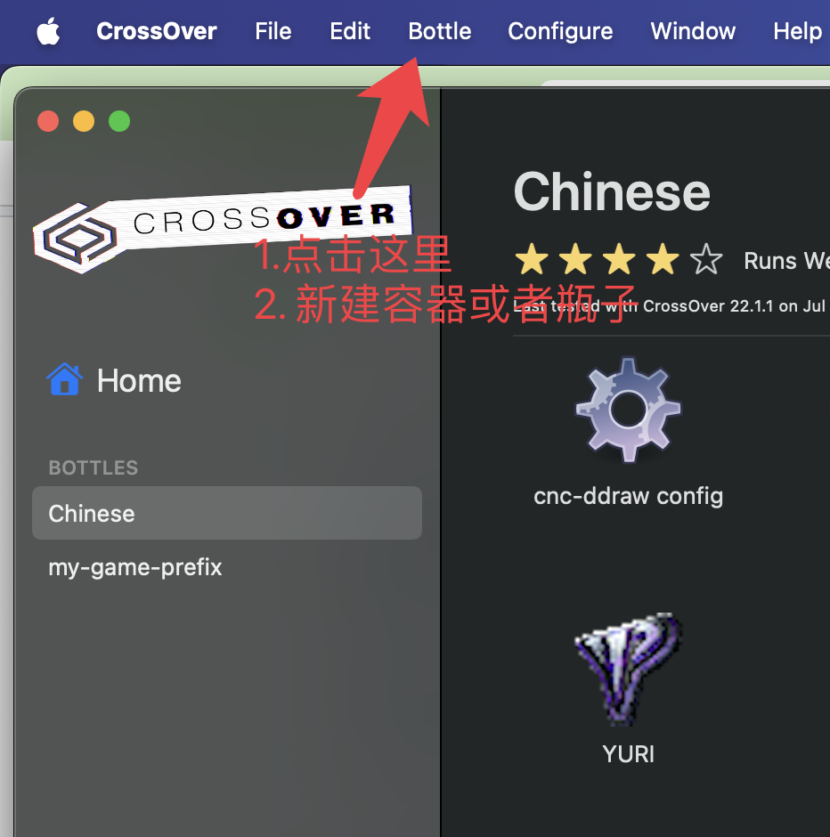
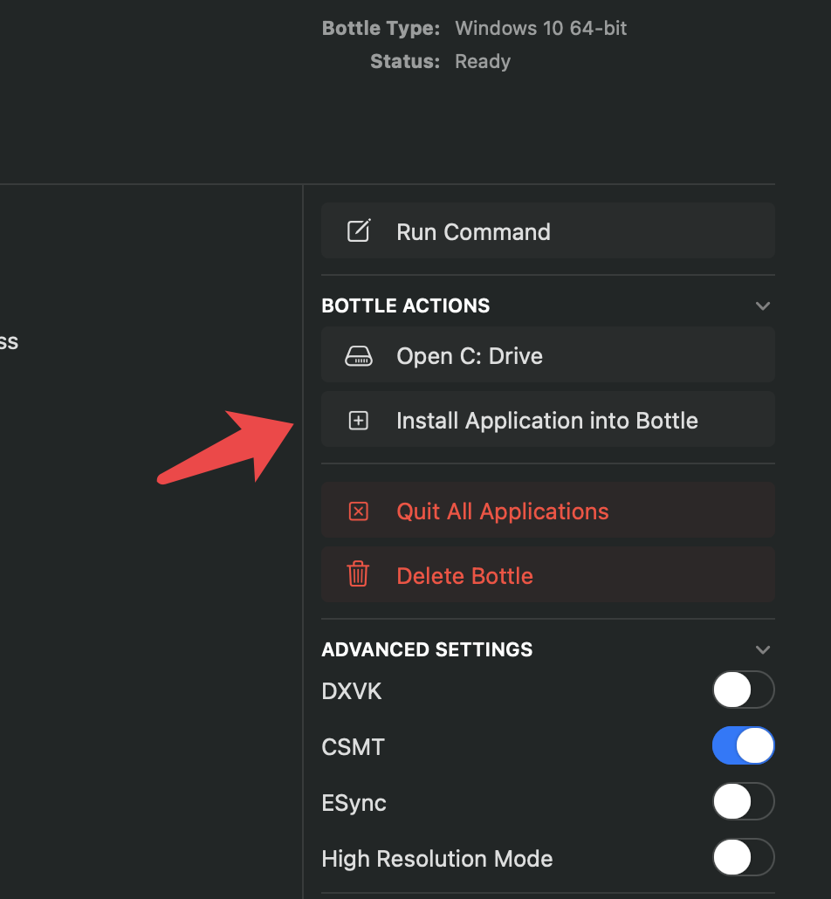
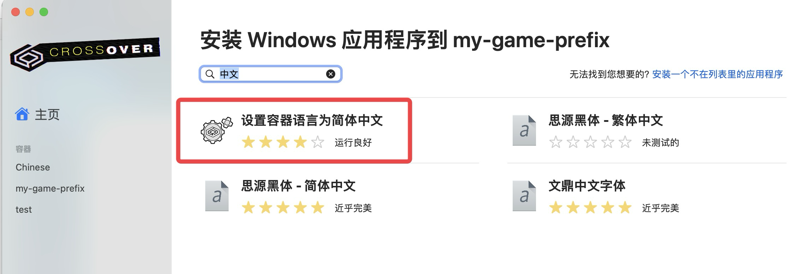
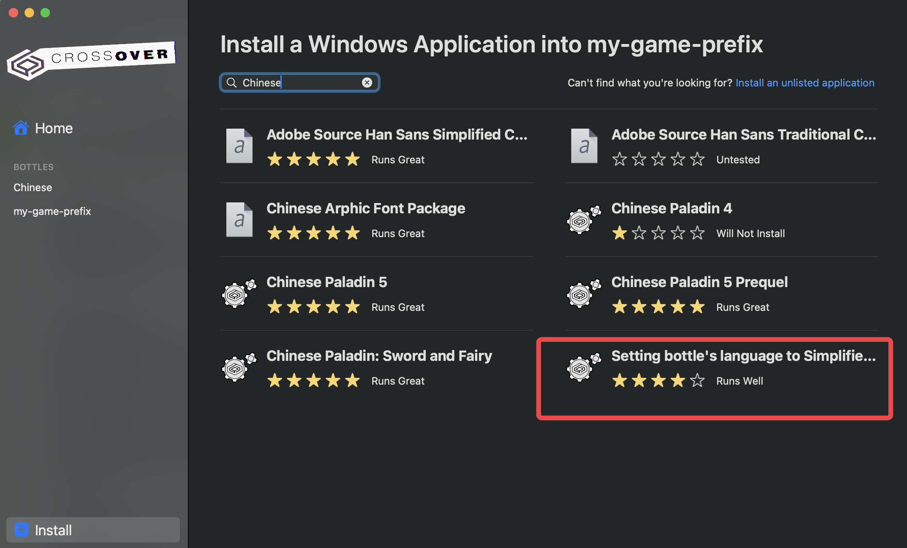
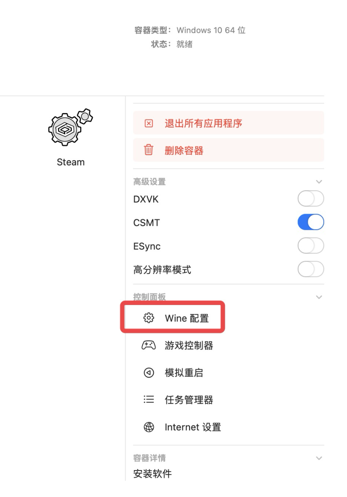
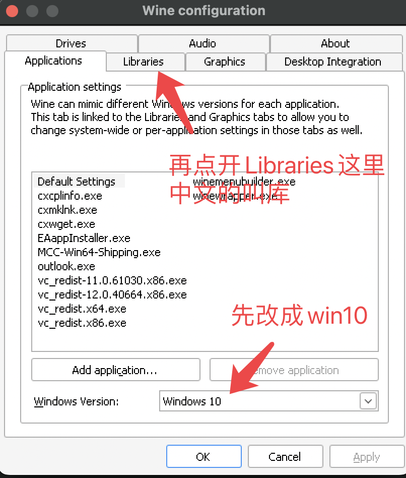
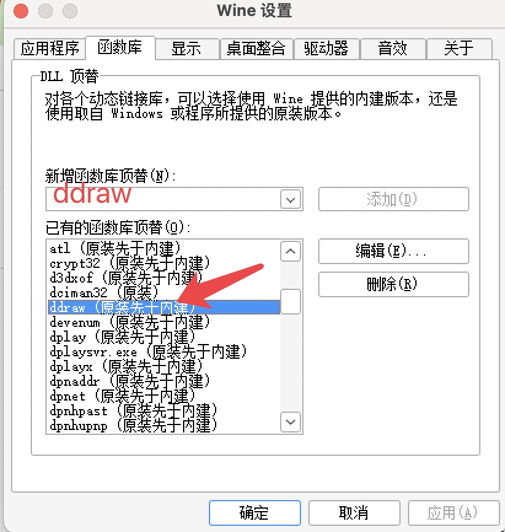
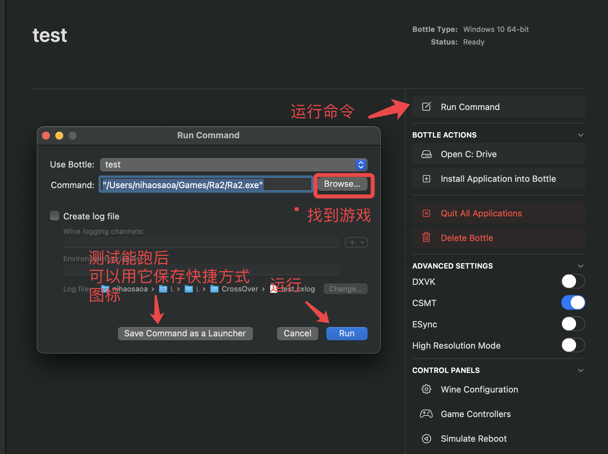
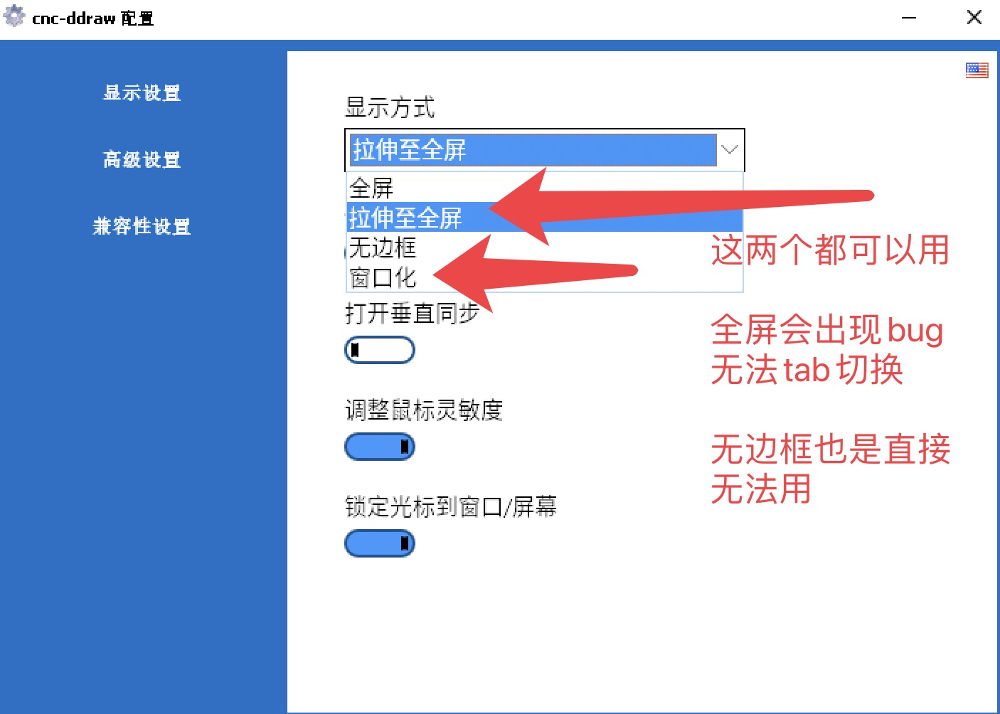
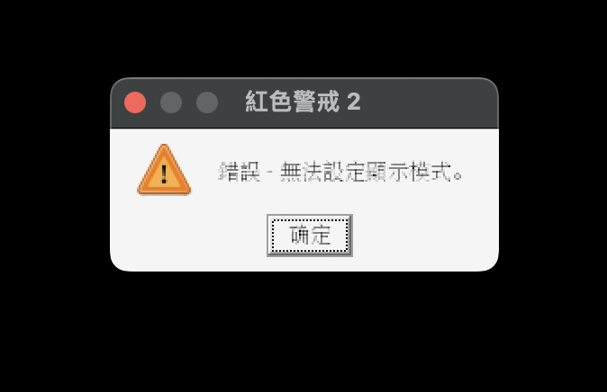

# M1/M2 Mac上如何完美玩上红警2

## 环境要求
- macOS Sonoma目前它在beta版本
- 红警2游戏
## 需要下载的文件
下载crossover混合Game Porting Toolkit需要的工具：[https://github.com/elisezhu123/Crossover_gpt_patch/releases](https://github.com/elisezhu123/Crossover_gpt_patch/releases)
分别安装
1. [Command_Line_Tools_for_Xcode_15_beta_2.dmg(自己去苹果那边下载这个最多目前beta3)](https://github.com/elisezhu123/Crossover_gpt_patch/releases/download/v1.04/Command_Line_Tools_for_Xcode_15_beta_2.dmg)
2. [gstreamer-1.0-1.22.4-universal.pkg](https://github.com/elisezhu123/Crossover_gpt_patch/releases/download/v1.04/gstreamer-1.0-1.22.4-universal.pkg)  
3. [Crossover_gpt.pkg](https://github.com/elisezhu123/Crossover_gpt_patch/releases/download/v1.04/Crossover_gpt.pkg)

首先把上面的几个都安装了，你可能会遇到多次报错，说文件损坏，并且需要多次去系统设置-> 隐私和安全下面允许安装，才可以安装完毕  
须知：Crossover是付费软件，请支持正版，默认有14天试用期（你实在是不想付钱可以自己搜方法，这里不给提供）

安装好后去下载[cnc-ddraw.zip](https://github.com/FunkyFr3sh/cnc-ddraw/releases/latest/download/cnc-ddraw.zip)
并且把所有内部文件解压到游戏根目录下，有冲突就覆盖（说明你这版的红警2已经有人装了它）

## 安装完毕后
## 先新建容器

# 解决中文乱码
## 首先来点开安装软件

Crossover安装软件，如果你是英文操作系统去搜索Chinese而不是中文：

英文选这个：

## 安装完中文后要配置wine：

## 修改wine配置细节
### 最重点是在wine的函数库（library)这里面加上ddraw，如图成功在下面显示出来，然后应用，并且确定

## 添加游戏并且运行

#### 这里备注一下，可以添加游戏运行，也可以添加游戏的安装包，但是要记得在安装完后的路径下，再次去找ra2.exe，或者yuri.exe（根据红警2版本），c盘是可以在crossover里面打开的，但是不强制，也可以用Mac本地的文件，这个默认是z盘

## 配置ddraw
### 按照上面运行游戏的方法来运行游戏目录下的cnc-ddraw config.exe文件
### 这么配置防止cmd + tab后无法回去游戏黑屏

### 拉伸至全屏效果：

### 窗口模式效果：

## 红警2在Mac安装常见问题和错误
1. Q: 红色警戒2:错误 - 无法设定显示模式  
   A: 去wine设置里，点击函数库（library）页面，去里面添加ddraw，没有添加ddraw就会出现这个问题，上面**修改wine配置细节**有写过  

# 末尾想说的
至此应该已经可以跑起来任何红警2的游戏了  
而且你可以跑的不只是红警2，我目前已经跑成功了steam（直接用首页那个安装一步到位，完美跑起来了小白兔电商和火山的女儿），还在废了不少功夫的情况下跑起来了古老的rpg小游戏和各种gal（经历了cli版game porting toolkit的各种依赖不全导致的游戏及其卡顿，中文方块儿，和很多问题，在这个方法下都是一下解决了）
也一下就跑起来了pc版原神（有点草地小显示bug还在研究怎么解决，和m2 air带起来吃力）  
用这个魔改的crossover加上game porting toolkit比官方的超级命令行和步骤要方便很多，但是官方的实在是太慢也很麻烦，尤其是中文部分和一些c++, .net还有字体依赖都很难解决，想装依赖就按照装中文的那部去搜索依赖就好了

感谢处之漠然 [https://space.bilibili.com/131564072](https://space.bilibili.com/131564072) 在[@3Shain](https://github.com/3shain)群里的鼎力帮助，大家可以去关注她写的攻略和视频，虽然比较长但是也挺有干货的 
    
以及这份儿魔改crossover+game porting toolkit工具是她写的[@elisezhu123](https://github.com/elisezhu123)
